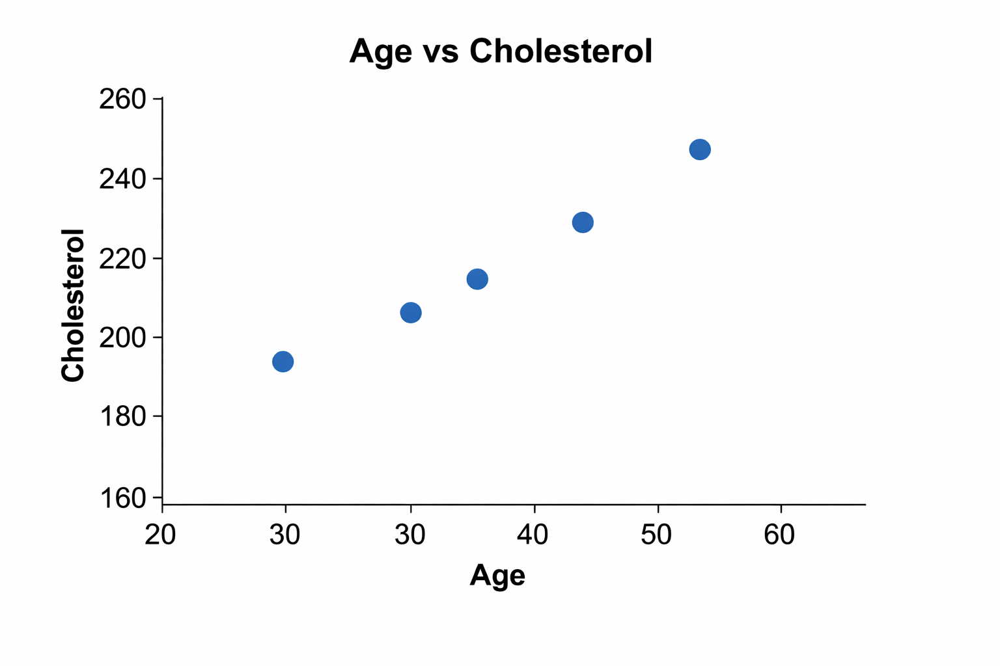

# Health Data Analysis

This project focuses on analyzing health and laboratory-style datasets
using Python and SQL.

## Objectives
- Practice data cleaning and exploratory data analysis
- Work with health-related tabular data
- Apply SQL queries for meaningful insights

## Tools
- Python
- SQL
- Pandas
- Matplotlib
- Jupyter Notebook

## Status
Work in progress
# Health Data Analysis

This project focuses on analyzing health datasets using Python and SQL.

## Sample Output

Here is a simple visualization from the analysis:

